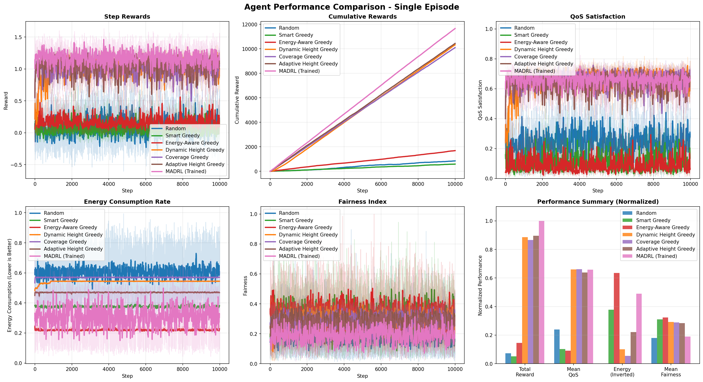
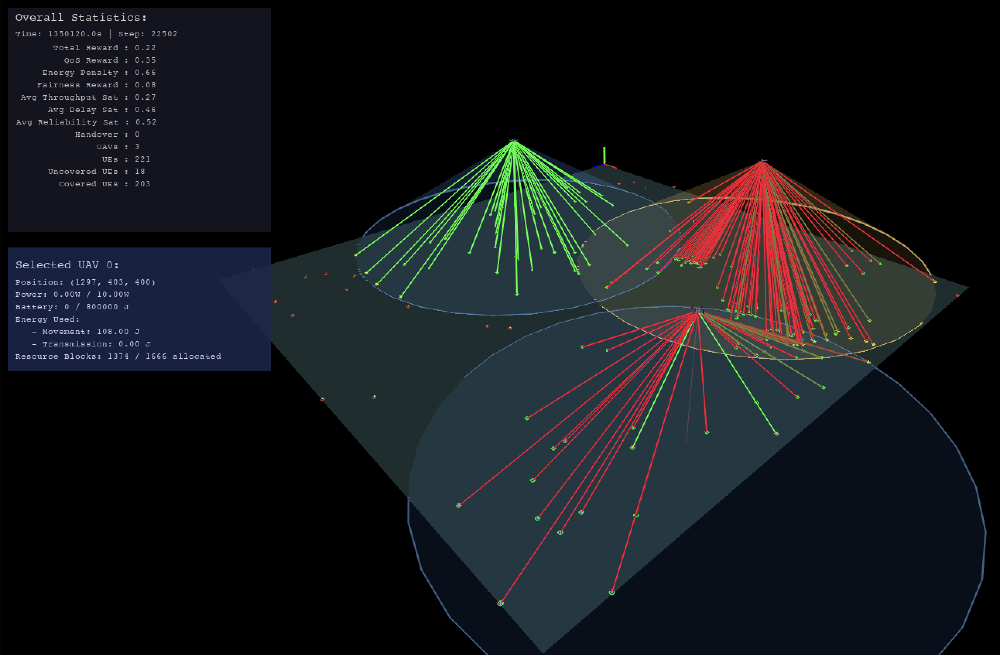

# QRL Network Slicing — Training & Simulation

Short project README for the training and simulation codebase used in the QRL Network Slicing experiments.

## Overview
This repository contains training and simulation code to evaluate reinforcement-learning-based network slicing policies (QRL). It includes configs, training scripts, simulation harnesses, and utilities for experiments and reproducibility.

## Highlights
- Training pipeline for QRL agents.
- Simulation environment for slice performance evaluation.
- Config-driven experiments and logging.
- Hooks for evaluation metrics and visualization.

## Quickstart

Prerequisites
- Python 3.8+ (use pyenv/venv)
- pip

Install
```bash
python -m venv .venv
source .venv/bin/activate
pip install -r requirements.txt
```

Run a training job (example)
```bash
python train.py --config configs/train_example.yaml --output runs/run01
```

Run a simulation / evaluation
```bash
python simulate.py --config configs/sim_example.yaml --model runs/run01/checkpoint.pth --output results/run01
```

Common flags
- --config : path to YAML config
- --output : output directory for logs, checkpoints, results
- --seed : random seed for reproducibility

## Repository layout
- configs/            — experiment and simulation YAMLs  
- src/                — implementation (agents, envs, utilities)  
- train.py            — training entrypoint  
- simulate.py         — simulation / evaluation entrypoint  
- requirements.txt    — Python dependencies  
- scripts/            — helper scripts (batch runs, plotting)  
- results/            — example results (generated)  
- README.md           — this file

## Reproducibility notes
- Set --seed for deterministic runs where possible.
- Save full config and environment versions with each run (use run folder).
- Use the provided logging utilities to capture metrics and checkpoints.

## Results / Figures

  



(If images are not present yet, add them to docs/images/ and commit.)

## How to cite
If you use this code or results in your work, please cite this project kindly. Example BibTeX entry (fill in details):

@misc{nguyen2025qrl,
    author = {Thanh D. Nguyen},
    title = {QRL Network Slicing: Training and Simulation Code},
    year = {2025},
    howpublished = {GitHub repository},
    note = {URL: https://github.com/yourname/qrl-network-slicing, commit: <commit-hash>}
}

Short citation note to include in papers:
"Code and experiments are available at https://github.com/yourname/qrl-network-slicing (see README for details). Please cite Nguyen (2025)."

## Contributing & support
- Open an issue for bugs or questions.
- Create pull requests for features or fixes.
- Include a reproducer and config when reporting issues.

## License
Add or replace with the project license of your choice (e.g., MIT, Apache-2.0). Currently: LICENSE file placeholder.

## Contact
For questions about experiments or reproducibility, open an issue or contact the repository owner.

<!-- End of README -->